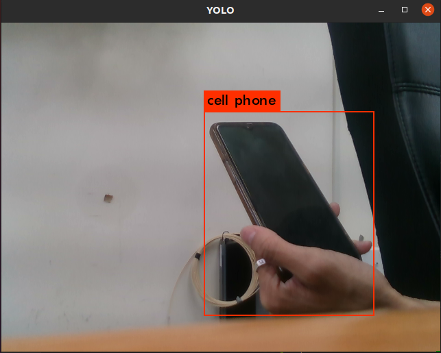
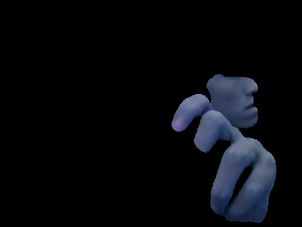
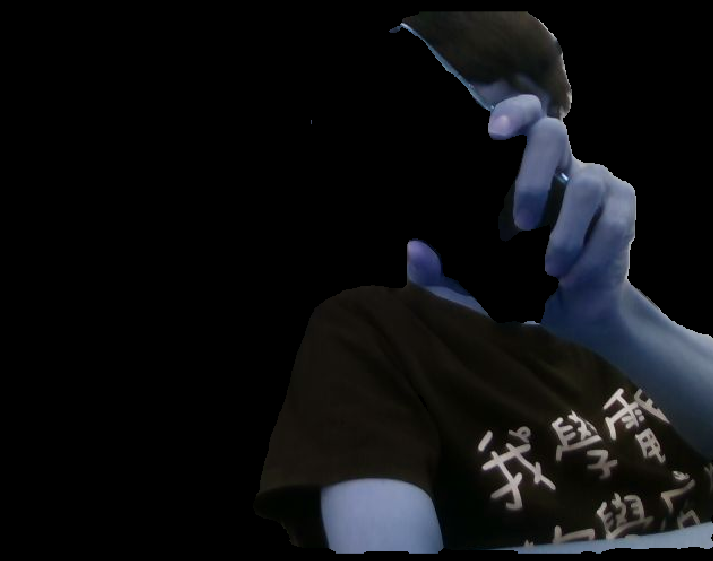
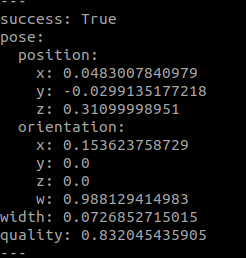

# handover-GGCNN

This project is an human robot interaction approach by Rosenberger. 

- The project includes

  -  [darknet_ros](https://github.com/ARG-NCTU/darknet_ros)
  
  -  [egohands_ros](https://github.com/ARG-NCTU/egohands_ros)

  -  [bodyparts_ros](https://github.com/ARG-NCTU/bodyparts_ros)
  
  -  [ggcnn_humanseg_ros](https://github.com/ARG-NCTU/ggcnn_humanseg_ros)

  
## Getting Started 

### Step 1 - Docker

```bash
$ cd handover-GGCNN/Docker
$ source build.sh 
``` 

```bash
$ cd handover-GGCNN
$ source docker_run.sh / docker_join.sh
``` 

### Step 2 - darknet_ros (Yolo v2)

```bash
$ source docker_run.sh
$ cd handover-GGCNN
$ source catkin_make.sh
```     
```bash
$ source docker_join.sh
$ cd handover-GGCNN
$ source environment.sh
$ roslaunch realsense2_camera rs_rgbd.launch
```   
```bash
$ source docker_join.sh
$ cd handover-GGCNN
$ source environment.sh
$ roslaunch darknet_ros darknet_ros.launch
``` 

     
### Step 3 - egohands_ros

The code have been tested with Python 3.6.

For using the pre-trained NN, the weights need to be downloaded from [Google Drive](https://drive.google.com/drive/folders/11kLgzLdFPy3yl03X6lBetebDpU5wLMQv) and placed in the folder " /src/helper_CSAILVision/lib/segmentation/ ".

```bash
$ source docker_join.sh
$ cd handover-GGCNN
$ source environment.sh
$ roslaunch egohands_ros egohands_publisher.launch
```


### Step 4 - bodyparts_ros

```bash
$ source docker_join.sh
$ cd handover-GGCNN
$ source environment.sh
$ roslaunch bodyparts_ros bodyparts_publisher.launch
```


### Step 5 - ggcnn_humanseg_ros

```bash
$ source docker_join.sh
$ cd handover-GGCNN
$ source environment.sh
$ roslaunch ggcnn_humanseg_ros ggcnn_humanseg_publisher.launch
```


Connect ViperX300s or other manipulator
```bash
$ rosrun ggcnn_humanseg_ros ggcnn_strategy.py
```